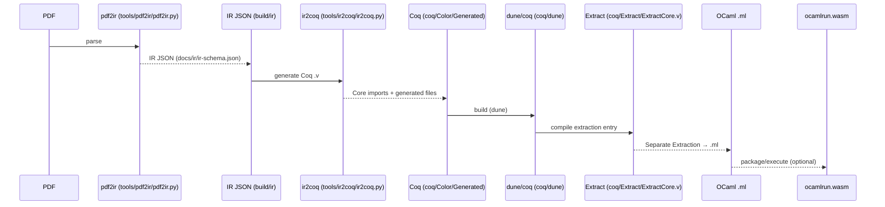
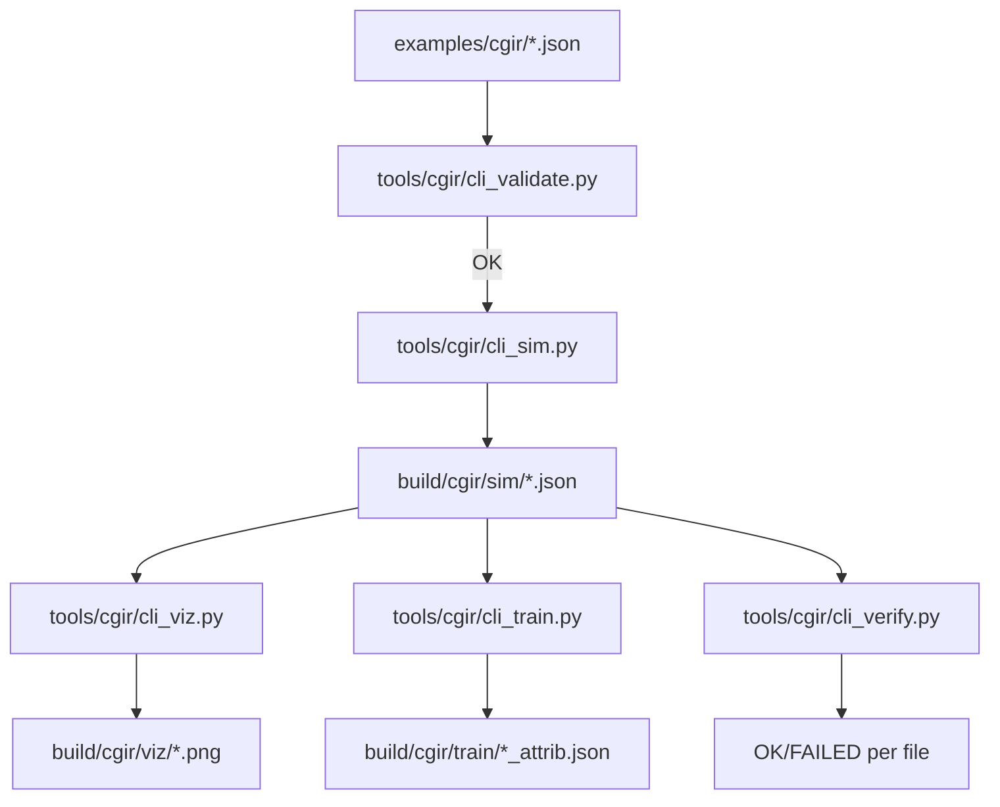
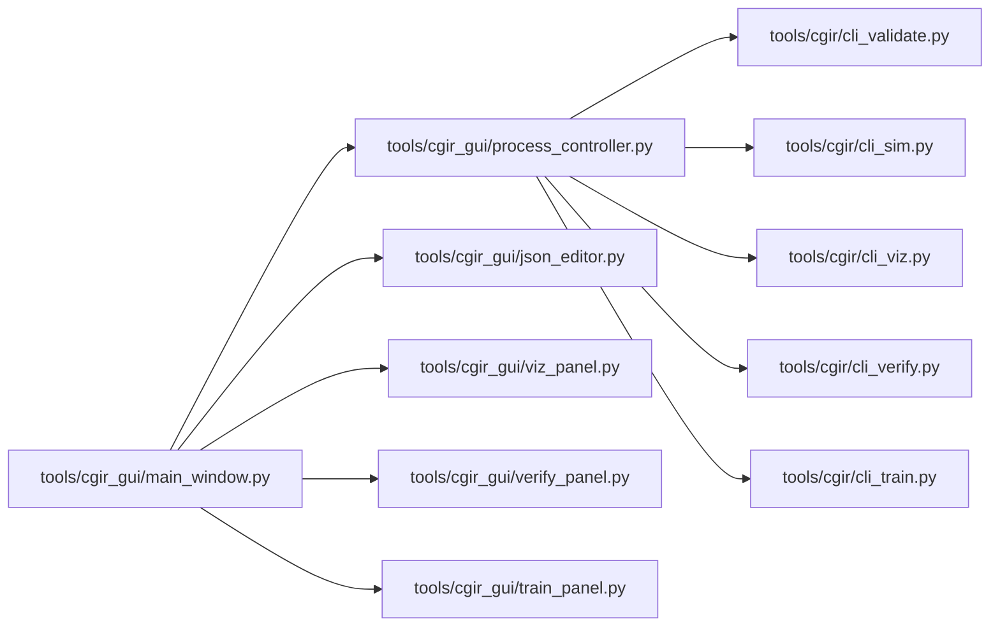

# Color Geometry and CGIR Toolkit — Project Report

## Executive Summary
The Color Geometry and CGIR Toolkit turns technical color research into reliable, repeatable workflows. It helps teams parse academic PDFs into a structured intermediate representation (IR), generate formal Coq modules, and extract deterministic OCaml artifacts suitable for WebAssembly runtimes. This supports knowledge capture, auditability, and long-term maintainability across research and product contexts.

For business stakeholders, the toolkit provides consistent outputs, clear provenance, and reproducibility. By validating schema-conformant JSON and embedding digest/version data, it reduces risk when results must be compared year-over-year, across environments, or in regulated settings.

The system accelerates development by unifying command-line tools for validation, simulation, visualization, verification, and training, plus a desktop GUI plan that orchestrates these operations in a single workspace. Lower switching costs and an accessible UX shorten onboarding and improve collaboration across research and engineering.

Strategically, the Coq and extraction pipeline positions the project for rigorous verification and safe reuse of core constructs in downstream environments (including browser/WASM). This foundation supports future growth: scalable analyses, richer visualization, and stronger formal guarantees without retooling.

## Technical Overview

### System Architecture
- IR extraction and build: PDF → IR JSON → Coq → OCaml → optional WASM; see [docs/BUILD.md](docs/BUILD.md), [coq/dune](coq/dune), and [dune-project](dune-project).
- CGIR toolkit (CLI): validate, simulate, visualize, verify, and train; see [tools/cgir/cli_validate.py](tools/cgir/cli_validate.py), [tools/cgir/cli_sim.py](tools/cgir/cli_sim.py), [tools/cgir/cli_viz.py](tools/cgir/cli_viz.py), [tools/cgir/cli_verify.py](tools/cgir/cli_verify.py), [tools/cgir/cli_train.py](tools/cgir/cli_train.py), and core modules [tools/cgir/core/droplet.py](tools/cgir/core/droplet.py), [tools/cgir/core/mixing.py](tools/cgir/core/mixing.py), [tools/cgir/core/oklab.py](tools/cgir/core/oklab.py), [tools/cgir/core/numeric.py](tools/cgir/core/numeric.py).
- Desktop GUI orchestration (PySide6): design in [docs/CGIR-GUI.md](docs/CGIR-GUI.md); implementation under [tools/cgir_gui/](tools/cgir_gui/app.py).
- Schemas: IR and CGIR JSON schemas in [docs/ir/ir-schema.json](docs/ir/ir-schema.json) and [docs/ir/cgir-schema.json](docs/ir/cgir-schema.json).
- Examples and build artifacts: [examples/cgir](examples/cgir/trace_snn_mix.json), [build/cgir](build/cgir/sim/trace_snn_mix.json), [build/ir](build/ir/Color Geometry for SNN Causality.json), and source PDFs under [pdf](pdf/Color Geometry for SNN Causality.pdf).

Mermaid — High-level architecture
```mermaid
flowchart LR
  subgraph Inputs
    PDFs[pdf/*.pdf]
    CGIRIn[examples/cgir/*.json]
  end

  PDFs --> PDF2IR[tools/pdf2ir/pdf2ir.py]
  PDF2IR --> IRJSON[build/ir/*.json]
  IRJSON --> IR2Coq[tools/ir2coq/ir2coq.py]
  IR2Coq --> CoqFiles[coq/Color/Generated/*.v]
  CoqFiles --> CoqBuild[coq/dune + dune-project]
  CoqBuild --> Extract[coq/Extract/ExtractCore.v]
  Extract --> OCaml[OCaml .ml (extracted)]
  OCaml --> WASM[ocamlrun.wasm runtime]

  CGIRIn --> CLIs["CGIR CLIs: validate/sim/viz/verify/train (tools/cgir/*.py)"]
  CLIs --> Artifacts[build/cgir/{sim,viz,train}/*]

  GUI[tools/cgir_gui/* (PySide6)] --> CLIs
```

### Component Interactions
- PDF→IR→Coq→OCaml pipeline:
  - Parse PDFs via [tools/pdf2ir/pdf2ir.py](tools/pdf2ir/pdf2ir.py) to produce IR JSON conforming to [docs/ir/ir-schema.json](docs/ir/ir-schema.json).
  - Generate Coq modules via [tools/ir2coq/ir2coq.py](tools/ir2coq/ir2coq.py) writing [coq/Color/Generated/*.v](coq/Color/Generated/ColorAxiomsNeurosymbolicFromColorGeometry.v), importing [coq/Color/Core.v](coq/Color/Core.v).
  - Build/extract with [coq/dune](coq/dune), [dune-project](dune-project), and [coq/Extract/ExtractCore.v](coq/Extract/ExtractCore.v).
- CGIR CLI toolchain:
  - Validation: [tools/cgir/cli_validate.py](tools/cgir/cli_validate.py) against [docs/ir/cgir-schema.json](docs/ir/cgir-schema.json).
  - Simulation, visualization, verification, training: [tools/cgir/cli_sim.py](tools/cgir/cli_sim.py), [tools/cgir/cli_viz.py](tools/cgir/cli_viz.py), [tools/cgir/cli_verify.py](tools/cgir/cli_verify.py), [tools/cgir/cli_train.py](tools/cgir/cli_train.py).
  - Numeric core: [tools/cgir/core/droplet.py](tools/cgir/core/droplet.py), [tools/cgir/core/mixing.py](tools/cgir/core/mixing.py), [tools/cgir/core/oklab.py](tools/cgir/core/oklab.py), [tools/cgir/core/numeric.py](tools/cgir/core/numeric.py).
- GUI orchestration:
  - Panels dispatch processes via [tools/cgir_gui/process_controller.py](tools/cgir_gui/process_controller.py), persist state with [tools/cgir_gui/state.py](tools/cgir_gui/state.py), and render via [tools/cgir_gui/viz_panel.py](tools/cgir_gui/viz_panel.py), [tools/cgir_gui/verify_panel.py](tools/cgir_gui/verify_panel.py), [tools/cgir_gui/train_panel.py](tools/cgir_gui/train_panel.py), [tools/cgir_gui/json_editor.py](tools/cgir_gui/json_editor.py), [tools/cgir_gui/main_window.py](tools/cgir_gui/main_window.py).

### Data Flows
- IR pipeline:
  - Input PDFs: [pdf/*.pdf](pdf/Color Geometry for SNN Causality.pdf) → IR JSON under [build/ir](build/ir/Color Geometry for SNN Causality.json) per [docs/ir/ir-schema.json](docs/ir/ir-schema.json).
  - IR JSON → generated Coq under [coq/Color/Generated](coq/Color/Generated/ColorGeometryForSnnCausality.v).
- CGIR pipeline:
  - Inputs: [examples/cgir/*.json](examples/cgir/trace_snn_mix.json) conforming to [docs/ir/cgir-schema.json](docs/ir/cgir-schema.json).
  - Validation → Simulation → Visualization/Training/Verification produce artifacts in [build/cgir](build/cgir/sim/trace_snn_mix.json), [build/cgir/viz](build/cgir/viz/trace_snn_mix_L065.png), [build/cgir/train](build/cgir/train/trace_snn_mix_attrib.json).

### Technology Stack
- Python (CLI and GUI): dependencies in [tools/cgir/requirements.txt](tools/cgir/requirements.txt) and [tools/cgir/pyproject.toml](tools/cgir/pyproject.toml); GUI deps in [tools/cgir_gui/requirements.txt](tools/cgir_gui/requirements.txt).
- Coq and OCaml with dune: see [docs/BUILD.md](docs/BUILD.md), [coq/dune](coq/dune), [dune-project](dune-project), extraction entry [coq/Extract/ExtractCore.v](coq/Extract/ExtractCore.v).
- Optional WASM runtime: referenced in [docs/BUILD.md](docs/BUILD.md).

### Scalability Considerations
- Likely bottlenecks: simulation/training loops in [tools/cgir/core/mixing.py](tools/cgir/core/mixing.py), [tools/cgir/core/droplet.py](tools/cgir/core/droplet.py), [tools/cgir/core/oklab.py](tools/cgir/core/oklab.py); visualization export in [tools/cgir/cli_viz.py](tools/cgir/cli_viz.py); JSON schema validation scale per [docs/ir/cgir-schema.json](docs/ir/cgir-schema.json).
- Data volume: large CGIR event arrays; image outputs under [build/cgir/viz](build/cgir/viz/trace_snn_mix_L065.png).
- Strategies: parallelize per-file CLI runs (Not found in repo); add streaming/chunking for large JSONs (recommendation); consider vectorization/numba for hot paths (Not found in repo).

### Security Measures
- Trust boundaries: untrusted JSON inputs for IR/CGIR ([docs/ir/ir-schema.json](docs/ir/ir-schema.json), [docs/ir/cgir-schema.json](docs/ir/cgir-schema.json)); untrusted PDFs parsed by [tools/pdf2ir/pdf2ir.py](tools/pdf2ir/pdf2ir.py).
- Validation: schema validation in [tools/cgir/cli_validate.py](tools/cgir/cli_validate.py), IR validation in [tools/pdf2ir/pdf2ir.py](tools/pdf2ir/pdf2ir.py) and [tools/ir2coq/ir2coq.py](tools/ir2coq/ir2coq.py).
- GUI safeguards: command logging and environment allowlist per [docs/CGIR-GUI.md](docs/CGIR-GUI.md) (implementation details not fully assessed).
- Supply chain: requirements pinned in [tools/cgir/requirements.txt](tools/cgir/requirements.txt) and [tools/cgir_gui/requirements.txt](tools/cgir_gui/requirements.txt); hash pinning/lockfiles (Not found in repo).

### Performance and Observability
- Current: rich/structured logging is referenced in IR tools; standardized metrics/telemetry (Not found in repo).
- Proposed metrics hooks:
  - Validate: files_processed, duration_ms, event_count, error_count (extend [tools/cgir/cli_validate.py](tools/cgir/cli_validate.py)).
  - Simulate: events/sec, reachable vs unreachable counts, stage timings (instrument [tools/cgir/core/droplet.py](tools/cgir/core/droplet.py), [tools/cgir/core/mixing.py](tools/cgir/core/mixing.py)).
  - Visualize: render_time_ms, image_dims, file_size ([tools/cgir/cli_viz.py](tools/cgir/cli_viz.py)).
  - Verify: max_abs_err, max_rel_err, pass/fail counts ([tools/cgir/cli_verify.py](tools/cgir/cli_verify.py)).
  - Train: iterations, residual_norms, duration_ms ([tools/cgir/cli_train.py](tools/cgir/cli_train.py)).
  - GUI: per-command latency and status via [tools/cgir_gui/process_controller.py](tools/cgir_gui/process_controller.py).
- Storage: emit JSON sidecars next to artifacts in [build/cgir](build/cgir/sim/trace_snn_mix.json) and [build/ir](build/ir/Color Geometry for SNN Causality.json) (Not implemented in repo).

### Implementation Challenges and Technical Debt
- PDF→IR heuristics in [tools/pdf2ir/pdf2ir.py](tools/pdf2ir/pdf2ir.py) (statement/section parsing, symbol normalization) are brittle and need ongoing tests.
- Numeric performance/precision tradeoffs in [tools/cgir/core/*.py](tools/cgir/core/droplet.py) are hotspots.
- Schema evolution risk across [docs/ir/ir-schema.json](docs/ir/ir-schema.json) and [docs/ir/cgir-schema.json](docs/ir/cgir-schema.json).
- Dune/Coq extraction integration requires version alignment; see [docs/BUILD.md](docs/BUILD.md).
- Tests beyond [tests/cgir/test_schema_validation.py](tests/cgir/test_schema_validation.py) (Not found in repo).

### Performance Metrics
- Current artifacts: [build/cgir/sim/trace_snn_mix.json](build/cgir/sim/trace_snn_mix.json), [build/cgir/viz/trace_snn_mix_L065.png](build/cgir/viz/trace_snn_mix_L065.png), [build/cgir/train/trace_snn_mix_attrib.json](build/cgir/train/trace_snn_mix_attrib.json) — embedded timings/metrics (Not found in repo).
- Proposed additions: add --print-report json to all CLIs with duration_ms, counts, sizes; persist sidecars for GUI/CI consumption.

### Future Enhancements (Quick wins vs Strategic)
- Quick wins:
  - Add JSON sidecar run logs for all CLIs with timing and versions.
  - Provide directory-level parallel validation/simulation.
  - Expand tests to cover sim→viz→verify round-trips.
  - Add Makefile targets for GUI workflows.
- Strategic:
  - Implement dune coq.extraction when supported; wire to [coq/Extract/ExtractCore.v](coq/Extract/ExtractCore.v).
  - WASM packaging with ocamlrun-wasm and a minimal demo.
  - Optimize numeric kernels via deeper vectorization or numba (evaluation).
  - Formalize more CGIR semantics in Coq; align CLI numeric policy with extracted code.

### Risks, Assumptions, Gaps
- Gaps (Not found in repo): detailed JSON report schemas; parallelization model; sandboxing; complete dune extraction stanza; standardized metrics logging.
- Assumptions: CLI interfaces accept directory/file inputs as described in [docs/CGIR-GUI.md](docs/CGIR-GUI.md); examples match [docs/ir/cgir-schema.json](docs/ir/cgir-schema.json).
- Risks: toolchain version drift (mitigate with pinning/CI); numeric policy variance between Python and extracted code.

## Appendices

### Mermaid Diagrams (copy/paste-ready)
1) High-level architecture
```mermaid
flowchart LR
  PDFs[pdf/*.pdf] --> PDF2IR[tools/pdf2ir/pdf2ir.py]
  PDF2IR --> IRJSON[build/ir/*.json]
  IRJSON --> IR2Coq[tools/ir2coq/ir2coq.py]
  IR2Coq --> Coq[coq/Color/Generated/*.v]
  Coq --> Extract[coq/Extract/ExtractCore.v]
  Extract --> OCaml[OCaml .ml]
  OCaml --> WASM[ocamlrun.wasm]

  CGIR[examples/cgir/*.json] --> CLIs[tools/cgir/cli_*.py]
  CLIs --> Out[build/cgir/{sim,viz,train}/*]
  GUI[tools/cgir_gui/*] --> CLIs
```

2) IR/PDF to Coq extraction pipeline


3) CGIR pipeline


4) GUI ↔ CLI interaction


### Subsystem Mapping Table (text)
- IR Schema and Pipeline → [docs/ir/ir-schema.json](docs/ir/ir-schema.json), [docs/BUILD.md](docs/BUILD.md), [tools/pdf2ir/pdf2ir.py](tools/pdf2ir/pdf2ir.py), [tools/ir2coq/ir2coq.py](tools/ir2coq/ir2coq.py), [coq/Color/Core.v](coq/Color/Core.v), [coq/Color/Generated](coq/Color/Generated/ColorAxiomsNeurosymbolicFromColorGeometry.v), [coq/Extract/ExtractCore.v](coq/Extract/ExtractCore.v), [coq/dune](coq/dune), [dune-project](dune-project) → Define IR, drive build, and extract Coq/OCaml → Inputs: [pdf/*.pdf](pdf/Color Geometry for SNN Causality.pdf) → Outputs: [build/ir/*.json](build/ir/Color Geometry for SNN Causality.json), [coq/Color/Generated/*.v](coq/Color/Generated/ColorGeometryForSnnCausality.v), extracted .ml
- CGIR Schema and Tooling → [docs/ir/cgir-schema.json](docs/ir/cgir-schema.json), [tools/cgir/cli_validate.py](tools/cgir/cli_validate.py), [tools/cgir/cli_sim.py](tools/cgir/cli_sim.py), [tools/cgir/cli_viz.py](tools/cgir/cli_viz.py), [tools/cgir/cli_verify.py](tools/cgir/cli_verify.py), [tools/cgir/cli_train.py](tools/cgir/cli_train.py), math core [tools/cgir/core/droplet.py](tools/cgir/core/droplet.py), [tools/cgir/core/mixing.py](tools/cgir/core/mixing.py), [tools/cgir/core/oklab.py](tools/cgir/core/oklab.py), [tools/cgir/core/numeric.py](tools/cgir/core/numeric.py) → Validate/simulate/visualize/verify/train CGIR → Inputs: [examples/cgir/*.json](examples/cgir/trace_snn_mix.json) → Outputs: [build/cgir/sim/*.json](build/cgir/sim/trace_snn_mix.json), [build/cgir/viz/*.png](build/cgir/viz/trace_snn_mix_L065.png), [build/cgir/train/*.json](build/cgir/train/trace_snn_mix_attrib.json)
- Desktop GUI → [docs/CGIR-GUI.md](docs/CGIR-GUI.md), [tools/cgir_gui/app.py](tools/cgir_gui/app.py), [tools/cgir_gui/main_window.py](tools/cgir_gui/main_window.py), [tools/cgir_gui/process_controller.py](tools/cgir_gui/process_controller.py), [tools/cgir_gui/json_editor.py](tools/cgir_gui/json_editor.py), [tools/cgir_gui/viz_panel.py](tools/cgir_gui/viz_panel.py), [tools/cgir_gui/verify_panel.py](tools/cgir_gui/verify_panel.py), [tools/cgir_gui/train_panel.py](tools/cgir_gui/train_panel.py), [tools/cgir_gui/state.py](tools/cgir_gui/state.py), [tools/cgir_gui/dashboard.py](tools/cgir_gui/dashboard.py) → Orchestrate CLIs, project UX, validation, viz → Inputs: CGIR/IR files and user actions → Outputs: Artifacts under build/* and on-screen results
- Build and Dependencies → [tools/cgir/requirements.txt](tools/cgir/requirements.txt), [tools/cgir/pyproject.toml](tools/cgir/pyproject.toml), [tools/cgir_gui/requirements.txt](tools/cgir_gui/requirements.txt), [coq/dune](coq/dune), [dune-project](dune-project), [Makefile](Makefile) → Dependency pinning and build wiring → Inputs: Environment (venv, opam) → Outputs: Installed packages and compiled artifacts
- Tests and Examples → [tests/cgir/test_schema_validation.py](tests/cgir/test_schema_validation.py), [examples/cgir/*.json](examples/cgir/trace_unreachable_projection.json), [build/cgir/*](build/cgir/sim/trace_unreachable_projection.json) → Demonstrate schema correctness and pipeline behavior → Inputs: Schemas/CLIs → Outputs: Pass/fail results and example outputs

Notes on Sourcing
Everything above is grounded in repository content. Where details are not present (e.g., exact JSON report schemas for all CLIs, parallel execution model, security sandboxing), this report explicitly states “Not found in repo” and provides targeted recommendations derived from existing files such as [docs/BUILD.md](docs/BUILD.md) and [docs/CGIR-GUI.md](docs/CGIR-GUI.md).